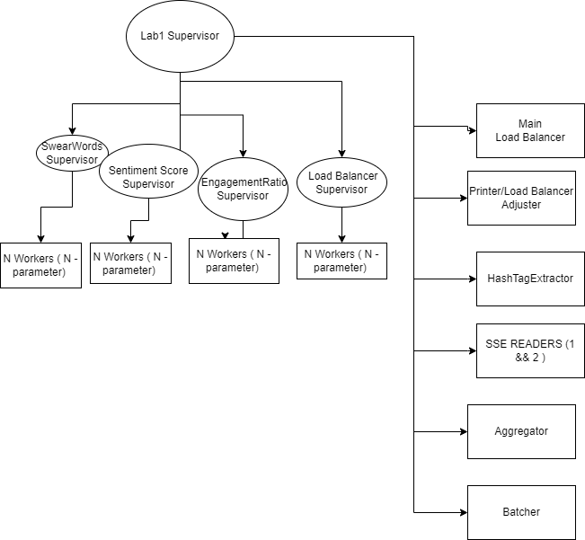
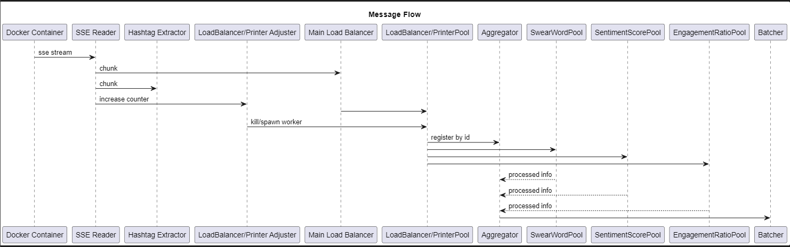

# FAF.PTR16.1 -- Project 1
> **Performed by:** Nicolae Gherman, group FAF-202
> **Verified by:** asist. univ. Alexandru Osadcenco


## Overall Arhitecture and Message Flow:  







## Overall Solution 

# The starting point is lab1.ex. Overlall supervision tree looks like: 

``` 
 children = [
      %{
        id: :SwearWordsRemoverSupervisor,
        start: {GenericSupervisorPool, :start,  [{"SwearWordsRemover", 3}] },
        type: :supervisor
      },
      %{
        id: :SentimentScoreSupervisor,
        start: {GenericSupervisorPool, :start,  [{"SentimentScore", 3}] },
        type: :supervisor
      },
      %{
        id: :EngagementRatioSupervisor,
        start: {GenericSupervisorPool, :start,  [{"EngagementRatio", 3}] },
        type: :supervisor
      },
      %{
        id: :PrinterSupervisor,
        start: {GenericSupervisorPool, :start, [ { "Printer", 3 } ]},
        type: :supervisor
      },
      %{
        id: :LoadBalancer,
        start: {LoadBalancer, :start,  [%{"pidCounter" => 3}] }
      },
      %{
        id: :HashTagEx,
        start: {HashtagExtractor, :start, []}
      },
      %{
        id: :Aggregator,
        start: {Aggregator, :start, [:ok]}
      },
      %{
        id: :Batcher,
        start: {Batcher, :start, [:ok]}
      },
      %{
        id: :SSE_READER1,
        start: {SSE_READER, :start, ["localhost:4000/tweets/1"]}
      },
      %{
        id: :SSE_READER2,
        start: {SSE_READER, :start, ["localhost:4000/tweets/2"]}
      },
      %{
        id: :WorkerPoolAdjuster,
        start: {PrintersAdjuster, :start, [:ok]}
      }
    ]
 
```  


# It all starts from reading from docker container: 

```
defmodule SSE_READER do
  use GenServer

  def start(url) do
    GenServer.start_link(__MODULE__, url )
  end

  def init(url) do
    IO.puts "Connecting to stream..."
    HTTPoison.get!(url, [], [recv_timeout: :infinity, stream_to: self()])
    {:ok, nil}
  end


  def handle_info(%HTTPoison.AsyncEnd{id: _}, state) do
    IO.puts("AAAAAAAAAAUUUUUUUUUUUUUUUUUUUUUUUUUUFFFFFFFFFFFFFFFFFfffff")
    {:noreply, state}
  end

  def handle_info(%HTTPoison.AsyncChunk{chunk: ""}, state) do
    GenServer.cast(LoadBalancer, :killMessage)
    {:noreply, state}
  end

  def handle_info(%HTTPoison.AsyncChunk{chunk: chunk}, state) do
    [_,data] =  Regex.run(~r/data: ({.+})\n\n$/, chunk)
    case Jason.decode(data) do
      {:ok, chunkData} ->
        send(LoadBalancer, chunkData)
        send(HashtagExtractor, chunkData)
        send(PrintersAdjuster, :increaseCounter)
      {:error, _ } -> GenServer.cast(LoadBalancer, :killMessage); nil; {:noreply, state}

    end
    {:noreply, state}
  end


  def handle_info(%HTTPoison.AsyncStatus{} = status, state) do
    IO.puts "Connection status: #{inspect status}"
    {:noreply, state}
  end

  def handle_info(%HTTPoison.AsyncHeaders{} = headers, state) do
    IO.puts "Connection headers: #{inspect headers}"
    {:noreply, state}
  end

end


```
The handle_info callback is called when a message is sent to the GenServer process mailbox that does not match any of the other defined callbacks. The SSE_READER module defines four handle_info callbacks:

1. handle_info(%HTTPoison.AsyncEnd{id: _}, state) handles the case where the stream ends.
2. handle_info(%HTTPoison.AsyncChunk{chunk: ""}, state) handles the case where an empty chunk is received. It sends a message to the LoadBalancer process to kill it.
3. handle_info(%HTTPoison.AsyncChunk{chunk: chunk}, state) handles the case where a non-empty chunk of data is received. It extracts the data using a regex and sends it to the   LoadBalancer, HashtagExtractor, and PrintersAdjuster processes. 
4. handle_info(%HTTPoison.AsyncStatus{} = status, state) handles the case where the connection status changes. It prints the new status.
5. handle_info(%HTTPoison.AsyncHeaders{} = headers, state) handles the case where headers are received. It prints the headers.

In summary, the SSE_READER module receives a stream of data from a given docker TCP address and processes it by sending it further. 


# The hashtag extractor: 

```
defmodule HashtagExtractor do
  use GenServer

  def start() do
    GenServer.start_link(__MODULE__, [], name: __MODULE__)
  end

  def init(state) do
    spawn(fn -> timeout() end )
    {:ok, state}
  end

  def handle_info(chunkData, state) do
    val = chunkData["message"]["tweet"]["entities"]["hashtags"]
    cond do
      val == [] -> {:noreply, state}
      true ->
        newVals = Enum.reduce(val,[], fn x,acc ->  acc ++ [String.trim(x["text"])] end )
        state = state ++ newVals
        {:noreply, state}
      end
  end

  def handle_call(:timeout,_from, state) do
    IO.puts("The popular hashtag status goes to:")
    IO.inspect(popular_hashtag(state))
    spawn(fn -> timeout() end )
    {:noreply, []}
  end


  def timeout() do
    :timer.sleep(5000)
    GenServer.call(__MODULE__, :timeout )
  end

  defp popular_hashtag(hashtags) do
      List.flatten(hashtags)
      |> Enum.reduce(%{}, fn hashtag, acc ->  Map.update(acc, hashtag, 1, fn existing_value  -> existing_value  + 1 end) end)
      |> Map.to_list()
      |> Enum.max_by(fn {_, maxVal} -> maxVal end)
      |> elem(0)
  end
end

``` 


The init/1 function is called when the server starts and initializes the server's state. In this case, it spawns a new process that will call timeout/0, which will run every five seconds. The initial state of the GenServer is an empty list.

The handle_info/2 function is called when the GenServer receives an asynchronous message (i.e., not a request or a response). In this case, it receives the chunkData, which is a map containing information about a tweet. The function extracts hashtags from the tweet, adds them to the state, and returns the new state.

The handle_call/3 function is called when the GenServer receives a synchronous message (i.e., a request). In this case, it receives the message :timeout. When this happens, the function logs the popular hashtag based on the state, spawns a new process that will call timeout/0 again and returns the new state as an empty list.

The timeout/0 function sleeps for five seconds and then calls the GenServer.call/2 function to send a synchronous message to the HashtagExtractor GenServer. This message has the atom :timeout as its content.

The popular_hashtag/1 function takes a list of hashtags and returns the most popular hashtag. It does this by flattening the list of hashtags, creating a map with the hashtag as the key and the count as the value, finding the maximum count, and returning the hashtag that has that count.

Overall, this module is designed to extract hashtags from tweets, keep track of them in a state and return the most popular hashtag every five seconds. 


# The second worker to which the chunk data is sent is Worker printer adjuster to adjust the workers depending on the number of request: 
``` 
defmodule PrintersAdjuster do
  use GenServer
  def start(_) do
    GenServer.start_link(__MODULE__ , 0, name: __MODULE__ )
  end

  def init(state) do
    spawn(fn -> timeout() end )
    {:ok, state}
  end

  def handle_info(:increaseCounter, state) do
    state = state + 1
    {:noreply, state}
  end

  def handle_info( :timeout, state) do
    childrenCountAll = Supervisor.count_children(PrinterPoolSupervisor)
    IO.inspect(childrenCountAll)
    IO.inspect("CURRENTTTT REQSS:::")
    IO.puts(state)
    if state > 500   and childrenCountAll.workers >= 3  do
      Supervisor.start_child(PrinterPoolSupervisor, %{id: String.to_atom("Printer#{childrenCountAll.workers + 1}"), start: {Printer, :start, [String.to_atom("Printer#{childrenCountAll.workers + 1}")]}})
    end
    if state < 500 and childrenCountAll.workers >= 3   do
      childrenCount = childrenCountAll.workers;
      GenServer.cast(:"Printer#{childrenCount}", :killMessage2)
    end
    spawn(fn -> timeout() end )
    state = 0
    {:noreply, state}
  end

  def timeout() do
    :timer.sleep(3000)
    send(__MODULE__, :timeout )
  end

end

```
 If the message is :timeout, it gets the current number of children workers in the PrinterPoolSupervisor supervisor and checks whether it needs to start or stop any printers based on the current state of the server. If the state is greater than 500 and the number of child workers is greater than or equal to 3, it starts a new printer. If the state is less than 500 and the number of child workers is greater than or equal to 3, it kills the last printer. It then spawns a new process that executes the timeout/0 function, resets the state to 0, and returns a tuple containing :noreply and the new state.

timeout(): It is a function that sleeps for 3000 milliseconds and sends a :timeout message to the server.


# The Worker pools are generated by a generic worker pool where is uses the factory method patterns for initializing: 

``` 
defmodule GenericSupervisorPool do
  use Supervisor

  @spec start({any, integer}) :: :ignore | {:error, any} | {:ok, pid}
  def start({name, n}) do
    {moduleName, supervisorName } = infoFactoryMethod(name)
    children = generateChildren(name, moduleName, n)
    Supervisor.start_link(__MODULE__, children, name: supervisorName)
  end

  def init(children) do
    Supervisor.init(children, strategy: :one_for_one,  max_restarts: 10, max_seconds: 10 )
  end

  defp infoFactoryMethod(name) do
    cond  do
      name == "Printer" -> {Printer, PrinterPoolSupervisor }
      name == "SwearWordsRemover" -> { SwearWordsRemover, SwearWordsRemoverPoolSupervisor }
      name == "SentimentScore" -> {SentimentScore, SentimentScorePoolSupervisor }
      name == "EngagementRatio" -> {EngagementRatio, EngagementRatioPoolSupervisor }
    end
  end

  defp generateChildren(name, module, n) do
    Enum.reduce(1..n,
      [],
      fn x, acc -> acc ++
      [%{
          id: :"#{name}#{x}",
          start: {module, :start, [:"#{name}#{x}"]}
        }]
      end  )
  end

end


``` 

Overall, this module provides a flexible and reusable way to start a pool of worker processes with a supervisor, using a single function call. It achieves this by mapping the worker process name to the corresponding worker module and supervisor module, and then generating a list of child processes that can be supervised by the supervisor.  


# First Worket pool would be some mini load balancers:  

``` 
defmodule Printer do
  use GenServer

  def start(name) do
    min =  5
    max = 50
    lambda = Enum.sum(min..max) / Enum.count(min..max)
    GenServer.start_link(__MODULE__ ,%{lambda: lambda}, name: name )
  end

  def init(state) do
    {:ok, state}
  end


  def handle_info(chunkData, state) do
    respId = GenServer.call(Aggregator, "registerReq")
    sendFrutherToSupervisorPool({ respId, chunkData["message"]["tweet"]["text"]}, "SwearWordsRemover", SwearWordsRemoverPoolSupervisor )
    sendFrutherToSupervisorPool({ respId, chunkData["message"]["tweet"]["text"]}, "SentimentScore", SentimentScorePoolSupervisor )
    sendFrutherToSupervisorPool({respId, chunkData}, "EngagementRatio", EngagementRatioPoolSupervisor )

    val = Statistics.Distributions.Poisson.rand(state[:lambda])
    :timer.sleep(trunc(val))
    {:noreply, state}
  end

  defp sendFrutherToSupervisorPool(chunkData, name, supervisorName) do
   #GenServer.call(supervisorName, chunkData["message"]["tweet"]["text"])
    childrenCountAll = Supervisor.count_children(supervisorName)
    len = childrenCountAll.workers
    Enum.filter(1..len, fn x -> Process.whereis(:"#{name}#{x}") != nil end)
    |> Enum.reduce( %{}, fn pidNum, acc ->
      Map.put(acc, :"#{name}#{pidNum}", Process.info(Process.whereis(:"#{name}#{pidNum}"), :message_queue_len ) )
     end )
    |> Map.to_list()
    |> Enum.min_by(fn {_, minMessageQueueLen} -> minMessageQueueLen end)
    |> elem(0)
    |> Process.whereis
    |> GenServer.cast(chunkData)
  end


  def handle_cast(:killMessage, state) do
    {:stop, :kek, state}
  end

  def handle_cast(:killMessage2, state) do
    {:stop, :kill, state}
  end


end

```

The defmodule Printer is another implementation of a GenServer module. The module is used for printing data by performing certain operations on it. The start function initializes a new GenServer process and starts it with a given name. The function calculates a random Poisson distribution value within the given range, using the Statistics.Distributions.Poisson module, and sets it as the initial state for the process.

The init function initializes the state argument.

The handle_info function processes incoming data by registering a new request with the Aggregator process and sending the data to other processes for further processing. The function calculates a random Poisson distribution value and sleeps the process for that time.

The sendFrutherToSupervisorPool function sends incoming data to a specified supervisor process for further processing by selecting the supervisor process with the lowest message queue length. The function filters out the supervisor processes that are not available and selects the one with the lowest message queue length.

The handle_cast function handles incoming cast messages, :killMessage and :killMessage2, which stops the GenServer process. If the message is :killMessage, the function returns {:stop, :kek, state}, which terminates the process. If the message is :killMessage2, the function returns {:stop, :kill, state}, which also terminates the process.


# The Redacter: 

``` 
defmodule SwearWordsRemover do
  use GenServer

  def start(name) do
    file_contents = File.read!("swear-words.json")
    {:ok, json_data} = Jason.decode(file_contents)
    GenServer.start_link(__MODULE__ , json_data , name:  name )
  end

  def init(state) do
    {:ok, state}
  end

  #def handle_call(sentence, from,   state) do
  def handle_cast({id, sentence}, state) do
    resp = Enum.map(String.split(sentence),  fn x ->
  if isBad?(x,state) == true do
    " ******"
    else
      " #{x}"
    end
    end)
    GenServer.cast(Aggregator, { id,  List.to_string(resp), 1 })
    #IO.inspect(List.to_string(resp))
    {:noreply, state}
  end


  defp isBad?(word,state) do
    w = String.downcase(word)
    Enum.member?(state,w)
  end


end

``` 

start/1: This function is used to start a new process of the SwearWordsRemover module. The function reads a file swear-words.json using the File.read!/1 function and decodes the JSON data in the file using the Jason.decode/1 function. The decoded JSON data is then passed as the initial state to the GenServer.start_link/3 function, which starts a new process with the SwearWordsRemover module as the callback module, and the JSON data as the initial state. The name of the process is specified by the argument name.

handle_cast/2: This function handles asynchronous messages sent to the process. It takes a tuple consisting of an ID and a sentence as its argument. The function splits the sentence into words using String.split/1 and then uses Enum.map/2 to apply a function to each word. If the word is found in the JSON data passed as the state to the process, it is replaced with ******. Otherwise, the word is returned as is. The result is then sent as a message to the Aggregator process using GenServer.cast/2, along with the ID and a score of 1. The function returns {:noreply, state}. 


# The sentiment scorer:  

```
defmodule SentimentScore do
  use GenServer

  def start(name) do
    url = "localhost:4000/emotion_values"
    %{body: response} = HTTPoison.get!(url)
    emoationalScoreMap =
      response
      |> String.split("\r")
      |> Enum.map( fn x  -> String.replace(x,"\n", "") end)
      |> Enum.map( fn x  -> String.split(x,"\t") end)
      |> Enum.reduce( %{}, fn x, acc  -> Map.put(acc, List.first(x), parseInt(x))  end)
    GenServer.start_link(__MODULE__ , emoationalScoreMap , name:  name )
  end

  defp parseInt(b) do
    {val, _ } = Integer.parse(List.last(b))
    abs(val)
  end

  def init(state) do
    {:ok, state}
  end


  def handle_cast({id, sentence},  state) do
    resp =
    Enum.map( String.split(sentence),  fn x ->
    val = state[x]
     cond do
      val == nil -> 0
      true -> val
     end
    end)
    #IO.puts("MEAN EMOTIONAL SCORE:")
    GenServer.cast(Aggregator, { id,  Enum.sum(resp) / Enum.count(resp) , 2 })
    #IO.inspect( Enum.sum(resp) / Enum.count(resp) )
    {:noreply, state}
  end
end

``` 

The handle_cast function is called when a message is cast to the server, which contains an id and a sentence. It splits the sentence into words and calculates the mean emotional score by looking up each word in the map and adding up the scores. If a word is not found in the map, its score is set to 0. Finally, it sends a message to the Aggregator server containing the id, mean emotional score, and a type of 2.

Overall, this module provides functionality for calculating a sentiment score for a given sentence based on the emotional words it contains. 


# The egagement ratio:  
``` 
defmodule EngagementRatio do
  use GenServer

  def start(name) do
    GenServer.start_link(__MODULE__ , :ok , name:  name )
  end

  def init(state) do
    {:ok, state}
  end


  def handle_cast({id, chunkData},  state) do
    val = chunkData["message"]["tweet"]["retweeted_status"]["favorite_count"]
    fav =
      cond do
        val == nil -> 0
        true -> val
      end
    val = chunkData["message"]["tweet"]["retweeted_status"]["retweet_count"]
    ret =
      cond do
        val == nil -> 0
        true -> val
      end


    followers = chunkData["message"]["tweet"]["user"]["followers_count"]

    engagementRatio =
    cond do
      followers == 0 -> 0.0
      true -> (fav + ret) / followers
    end

    #IO.puts("ENGAGEMENT RATIO:  ")
    #IO.inspect(engagementRatio)
    GenServer.cast(Aggregator, { id, engagementRatio , 3 })
    {:noreply, state}
  end
end
```


The handle_cast function is called when the GenServer receives a cast message. The message should contain a chunk of data related to a tweet, which is expected to be a map. The function extracts the retweet count, favorite count, and number of followers from the tweet data. It then calculates the engagement ratio as described above, and sends a cast message to the Aggregator process with the calculated engagement ratio and a type identifier of 3.

Finally, the function returns {:noreply, state}. The state parameter here is not used, and so the function simply returns the same state value that it received.


# The last three workers described above sends data to the Aggregator. To remind, the Printer registeres the id/type/index firstly and then passes them to the 3 workers described. Further, the workers passes info to the Aggegator: 


```
defmodule Aggregator do
  use GenServer

  def start(_) do
    GenServer.start_link(__MODULE__ , %{} , name:  __MODULE__ )
  end

  def init(state) do
    state = Map.put(state, 0, {-1,-1, -1} )

    {:ok, state}
  end

  def handle_call("registerReq", _, state) do
    resp =
      Map.keys(state)
      |> Enum.sort()
      |> Enum.take(-1)
      |> List.first()

    state = Map.put(state, resp+1, { -1, -1, -1} )
    {:reply, resp+1,  state}
  end

  def handle_cast({id, newData, i} ,  state) do
    {redactedText, sentimentScore,  engagementRatio }   = Map.get(state, id)
    state =
    cond do
      i == 1 ->  Map.replace(state, id,  {  newData, sentimentScore,  engagementRatio }  )
      i == 2 ->  Map.replace(state, id,  {  redactedText, newData,  engagementRatio }  )
      i == 3 ->  Map.replace(state, id,  {  redactedText, sentimentScore,  newData }  )
    end

    {redactedText, sentimentScore,  engagementRatio }   = Map.get(state, id)
    if redactedText != -1  and sentimentScore != -1  and engagementRatio != -1 do
      GenServer.cast(Batcher,   {redactedText, sentimentScore,  engagementRatio }  )
    end

    {:noreply, state}
  end
end

``` 

The init/1 function initializes the state with an empty map and a special key 0 that has the value {-1, -1, -1}, indicating that no data has been received yet.

When Aggregator receives a handle_cast/2 message, it updates the internal state with the new data using the provided ID and the integer value i that indicates which of the three values in the tuple should be updated. If all three values have been updated, it sends the data to the Batcher process by calling GenServer.cast/2.

The handle_cast/2 message expects a tuple with three values: id (an integer representing the index of the data in the internal state), newData (the new data to be added to the state), and i (an integer indicating which value in the tuple should be updated).

Overall, this module is responsible for maintaining a state that contains data from other processes and sending the aggregated data to the Batcher process when all required data has been received. 


# The Batcher where the data is printed:

``` 
defmodule Batcher do
  use GenServer

  def start(_) do
    GenServer.start_link(__MODULE__ ,%{}, name:  __MODULE__ )
  end

  @spec init(map) :: {:ok, map}
  def init(state) do
    state = Map.put(state, "currentFill", 0)
    state = Map.put(state, "batchSize", 10)
    state = Map.put(state, "printable",  [])
    state = Map.put(state, "currentTimeoutPid",  :ok)

    {:ok, state}
  end

  def handle_cast(:timeoutReset, state ) do
    { _,  existingTweets} = Map.fetch(state, "printable")
      IO.inspect(existingTweets)
      state = Map.replace(state, "printable", [] )
      state = Map.replace(state, "currentFill", 0 )
      {:noreply, state}
  end

  def handle_cast(:callTimeout, state ) do
    pid =
      spawn( fn ->
      :timer.sleep(10)
      GenServer.cast(__MODULE__ , :timeoutReset )
      end)
      state = Map.replace(state, "currentTimeoutPid", pid )
      {:noreply, state}
  end

  def handle_cast(chunkData,  state) do
    { _,  currentSize } = Map.fetch(state, "currentFill")
    { _,  bufferSize } = Map.fetch(state, "batchSize")


    if currentSize == 0 do
      GenServer.cast( self(), :callTimeout)
    end


    cond do

     currentSize >= bufferSize ->
      { _,  existingTweets} = Map.fetch(state, "printable")
      IO.inspect(existingTweets)
      state = Map.replace(state, "printable", [] )
      state = Map.replace(state, "currentFill", 0 )
      {_ ,  currentPid} = Map.fetch(state, "currentTimeoutPid")
      Process.exit(currentPid, :kill)
      {:noreply, state}

    currentSize < bufferSize ->


    {redactedText, sentimentScore,  engagementRatio } = chunkData

    newTweet = redactedText <> "; Sentiment Score: " <>  Float.to_string(sentimentScore) <> "; EngagementRatio: " <> Float.to_string(engagementRatio)

    { _,  existingTweet} = Map.fetch(state, "printable")

    updatedTweets = existingTweet ++ [newTweet]
    state = Map.replace(state, "printable", updatedTweets )

    { _,  currentSize } = Map.fetch(state, "currentFill")
    state = Map.replace(state, "currentFill", currentSize+1 )
    {:noreply, state}
    end

  end
end
```
 

 The module starts by defining the init function which initializes the state of the GenServer. The state is a map that holds the current fill of the batch, the batch size, a list of tweets that will be printed when the batch size is reached, and the current timeout process ID.

The handle_cast function is used to handle incoming messages. The module receives two types of messages: :timeoutReset and chunkData. The :timeoutReset message is used to reset the timeout process and print the existing tweets in the buffer. The chunkData message is the data that is being batched.

When a chunkData message is received, the handle_cast function first checks the current fill of the batch and compares it to the batch size. If the current fill is greater than or equal to the batch size, it resets the timeout process and prints the tweets in the buffer. If the current fill is less than the batch size, it adds the new tweet to the list of printable tweets and increments the current fill of the batch.

The handle_cast function also handles the :callTimeout message, which spawns a new process that waits for 10 seconds before sending a :timeoutReset message to the Batcher module.

Overall, this module is responsible for batching data and printing it once a certain batch size is reached. It uses a timeout process to ensure that data is printed if the batch size is not reached within a certain amount of time. 


## Conclusion 
1. The lab have been a great opportunity to implement Actor Modeling theory into practice, including Supervision Trees, Stream processing, mechanism on Actor Comunication/CSPs. 
2. Elixir is a powerful and versatile language that offers many benefits for developing concurent actor models. With its built-in support for concurrency, fault tolerance, and distributed systems, it is well-suited for development.
3. You have to study and make a careful arhitecture in order to promote fault tolerance and prohib data loss. 
